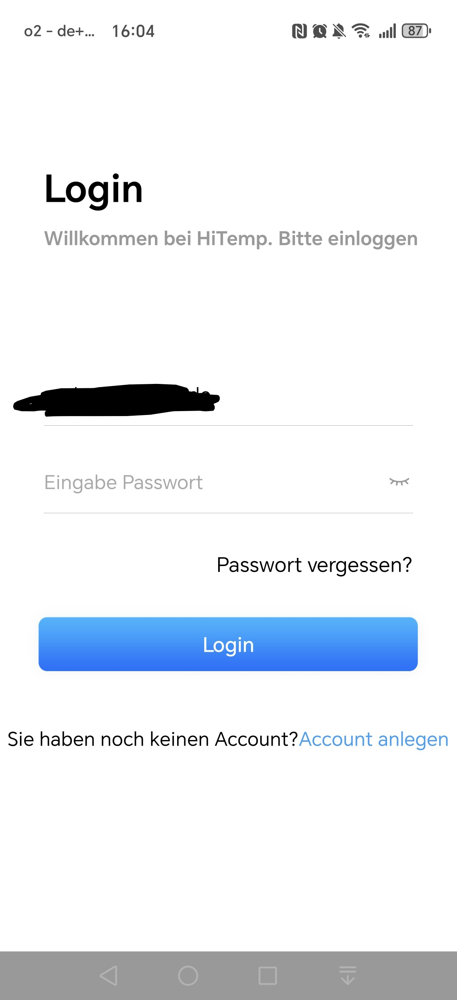
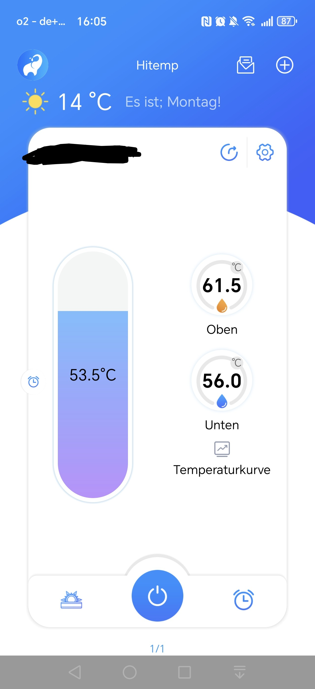
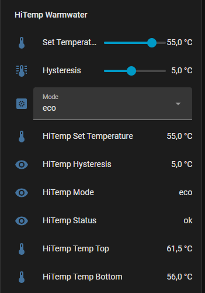

# HiTemp / AquaTemp Hot Water Heat Pump — Home Assistant MQTT Proxy

Control and monitor your **HiTemp** or **AquaTemp** compatible hot water heat pump from Home Assistant via MQTT — without the official HACS integration, without session conflicts, and with full parameter validation.

  

---

## What this does

This project provides a Python daemon (`hitemp_proxy.py`) that:

- Connects to the **HiTemp / AquaTemp cloud API** (`cloud.linked-go.com`)
- Polls your heat pump every **5 minutes** (matching the official app interval)
- Publishes all sensor values to your local **MQTT broker**
- Listens for commands from Home Assistant via MQTT
- **Validates and clamps** all incoming values before sending to the pump (no accidental 800°C setpoints)
- Handles **token refresh** automatically
- Runs as a **systemd service** — starts on boot, restarts on failure

---

## Supported Parameters

| Parameter | Code | Read | Write | Notes |
|-----------|------|------|-------|-------|
| Target Temperature | R01 | ✅ | ✅ | Clamped 38–60°C |
| Hysteresis | R03 | ✅ | ✅ | Clamped 1–10°C |
| Operating Mode | Mode | ✅ | ✅ | eco / hybrid / fast |
| Water Temp Bottom | T01 | ✅ | — | Sensor only |
| Water Temp Top | T02 | ✅ | — | Sensor only |
| Coil Temp | T03 | ✅ | — | Sensor only |
| Ambient Temp | T04 | ✅ | — | Sensor only |

### Operating Modes
| Mode Name | API Value |
|-----------|-----------|
| eco | 2 |
| hybrid | 3 |
| fast | 4 |

These values were discovered by live capture — changing the mode in the HiTemp app and immediately reading the API response. Only the `Mode` parameter changes between modes.

---

## Requirements

- Python 3.10+
- `paho-mqtt` library
- A HiTemp or AquaTemp account (see note below on single-session)
- A local MQTT broker (e.g. Mosquitto on Home Assistant)
- Ubuntu/Debian Linux VM or server

---

## Installation

### 1. Install dependency

```bash
pip install paho-mqtt --break-system-packages
```

### 2. Configure the proxy

Edit `hitemp_proxy.py` and set your credentials:

```python
HITEMP_USER     = "myemail@example.com"
HITEMP_PASSWORD = "mypassword"
DEVICE_CODE     = "XXXXXXXXXXXX"   # 12-char code from top-left of HiTemp app

MQTT_HOST       = "192.168.x.x"   # your MQTT broker IP
MQTT_PORT       = 1883
MQTT_USER       = "mqtt_username"
MQTT_PASS       = "mqtt_password"
```

> **Device Code**: Open the HiTemp app → your device is listed with a 12-character code in the top left corner (e.g. `0B8FRDB77323`).

> **Password**: Sent as MD5 hash — the proxy handles this automatically. Enter your plain text password.

### 3. Test before installing as service

```bash
python3 hitemp_proxy.py
```

You should see:
```
[INFO] HiTemp proxy starting
[INFO] HiTemp login OK
[INFO] MQTT connected
[INFO] Subscribed to command topics
[INFO] Published hitemp/state/temperature: 55.0
[INFO] Published hitemp/state/mode: eco
...
```

### 4. Install as systemd service

```bash
sudo cp hitemp-proxy.service /etc/systemd/system/
sudo systemctl daemon-reload
sudo systemctl enable hitemp-proxy
sudo systemctl start hitemp-proxy
sudo systemctl status hitemp-proxy
```

---

## MQTT Topics

### State (proxy → Home Assistant)

| Topic | Example Value | Description |
|-------|--------------|-------------|
| `hitemp/state/temperature` | `55.0` | Current set temperature |
| `hitemp/state/hysteresis` | `5.0` | Current hysteresis |
| `hitemp/state/mode` | `eco` | Current operating mode |
| `hitemp/state/temp_bottom` | `34.5` | Water temperature bottom of tank |
| `hitemp/state/temp_top` | `58.0` | Water temperature top of tank |
| `hitemp/state/temp_coil` | `62.5` | Coil temperature |
| `hitemp/state/temp_ambient` | `24.5` | Ambient/outdoor temperature |
| `hitemp/state/status` | `ok` | Proxy status (`ok`, `clamped:XX`, `error:XX`) |

### Commands (Home Assistant → proxy)

| Topic | Example Payload | Description |
|-------|----------------|-------------|
| `hitemp/set/temperature` | `57.5` | Set target temperature (38–60°C) |
| `hitemp/set/hysteresis` | `3.5` | Set hysteresis (1–10°C) |
| `hitemp/set/mode` | `hybrid` | Set mode: `eco`, `hybrid`, `fast` |

### Validation / Clamping
- Temperature below 38°C → clamped to 38°C
- Temperature above 60°C → clamped to 60°C
- Hysteresis below 1 → clamped to 1
- Hysteresis above 10 → clamped to 10
- Unknown mode → error published to `hitemp/state/status`
- On clamp: `hitemp/state/status` publishes `clamped:XX` so HA knows what was actually sent

---

## Home Assistant Configuration

### mqtt.yaml — add sensors

```yaml
sensor:
  - name: "HiTemp Set Temperature"
    unique_id: hitemp_set_temp
    state_topic: "hitemp/state/temperature"
    unit_of_measurement: "°C"
    device_class: temperature

  - name: "HiTemp Hysteresis"
    unique_id: hitemp_hysteresis
    state_topic: "hitemp/state/hysteresis"
    unit_of_measurement: "°C"

  - name: "HiTemp Mode"
    unique_id: hitemp_mode
    state_topic: "hitemp/state/mode"

  - name: "HiTemp Temp Bottom"
    unique_id: hitemp_temp_bottom
    state_topic: "hitemp/state/temp_bottom"
    unit_of_measurement: "°C"
    device_class: temperature

  - name: "HiTemp Temp Top"
    unique_id: hitemp_temp_top
    state_topic: "hitemp/state/temp_top"
    unit_of_measurement: "°C"
    device_class: temperature

  - name: "HiTemp Temp Coil"
    unique_id: hitemp_temp_coil
    state_topic: "hitemp/state/temp_coil"
    unit_of_measurement: "°C"
    device_class: temperature

  - name: "HiTemp Temp Ambient"
    unique_id: hitemp_temp_ambient
    state_topic: "hitemp/state/temp_ambient"
    unit_of_measurement: "°C"
    device_class: temperature

  - name: "HiTemp Status"
    unique_id: hitemp_status
    state_topic: "hitemp/state/status"
```

### input_number.yaml — add controls

```yaml
hitemp_target_temp:
  name: "HiTemp Target Temperature"
  min: 38
  max: 60
  step: 0.5
  unit_of_measurement: "°C"
  icon: mdi:thermometer

hitemp_hysteresis:
  name: "HiTemp Hysteresis"
  min: 1
  max: 10
  step: 0.5
  unit_of_measurement: "°C"
  icon: mdi:thermometer-lines
```

### input_select.yaml — add mode selector

```yaml
hitemp_mode:
  name: "HiTemp Mode"
  options:
    - eco
    - hybrid
    - fast
  icon: mdi:heat-pump
```

### automations.yaml — send commands to MQTT

```yaml
- id: hitemp_send_temperature
  alias: "HiTemp - Send temperature when changed"
  trigger:
    - platform: state
      entity_id: input_number.hitemp_target_temp
  action:
    - service: mqtt.publish
      data:
        topic: "hitemp/set/temperature"
        payload: "{{ states('input_number.hitemp_target_temp') }}"

- id: hitemp_send_hysteresis
  alias: "HiTemp - Send hysteresis when changed"
  trigger:
    - platform: state
      entity_id: input_number.hitemp_hysteresis
  action:
    - service: mqtt.publish
      data:
        topic: "hitemp/set/hysteresis"
        payload: "{{ states('input_number.hitemp_hysteresis') }}"

- id: hitemp_send_mode
  alias: "HiTemp - Send mode when changed"
  trigger:
    - platform: state
      entity_id: input_select.hitemp_mode
  action:
    - service: mqtt.publish
      data:
        topic: "hitemp/set/mode"
        payload: "{{ states('input_select.hitemp_mode') }}"
```

### Lovelace Card

```yaml
type: entities
entities:
  - type: section
    label: HiTemp Warmwater Controls
  - entity: input_number.hitemp_target_temp
    name: Set Temperature
    icon: mdi:thermometer
  - entity: input_number.hitemp_hysteresis
    name: Hysteresis
    icon: mdi:thermometer-lines
  - entity: input_select.hitemp_mode
    name: Mode
    icon: mdi:heat-pump
  - type: section
    label: HiTemp Warmwater Status
  - entity: sensor.hitemp_set_temperature
  - entity: sensor.hitemp_hysteresis
  - entity: sensor.hitemp_mode
  - entity: sensor.hitemp_status
  - entity: sensor.hitemp_temp_top
  - entity: sensor.hitemp_temp_bottom
  - entity: sensor.hitemp_temp_coil
  - entity: sensor.hitemp_temp_ambient
title: HiTemp Warmwater
show_header_toggle: false
state_color: true
```

---

## Important: Single Session Issue

HiTemp/AquaTemp v1.5.9+ only allows **one active login at a time**. If you run this proxy alongside the HiTemp app or the HACS integration, sessions will conflict and you will get `请重新登录` (please login again) errors.

**Solution:** Create a dedicated second account in the HiTemp app, share your device to that account, and use those credentials in the proxy. Remove the HACS AquaTemp integration if installed.

---

## API Details

Discovered via reverse engineering and community research.

- **Base URL:** `https://cloud.linked-go.com:449/crmservice/api`
- **Auth:** POST to `/app/user/login` with MD5-hashed password, returns `x-token` header
- **Read:** POST to `/app/device/getDataByCode` with `deviceCode` and `protocalCodes` array
- **Write:** POST to `/app/device/control` with `param` array, each entry containing `deviceCode`, `protocolCode`, `value`
- **Poll interval:** 300 seconds (5 minutes) — matches official integration, avoids session timeout

---

## Credits & References

This project would not exist without the work of these open source contributors:

- **[radical-squared/aquatemp](https://github.com/radical-squared/aquatemp)** — Home Assistant AquaTemp/HiTemp integration. The API base URL, endpoint paths, field names, password hashing method, and poll interval were all sourced from this integration's source code.
- **[MiRo1310/ioBroker.midas-aquatemp](https://github.com/MiRo1310/ioBroker.midas-aquatemp)** — ioBroker adapter for Midas/AquaTemp heat pumps. Confirmed API structure and parameter codes.
- **[dst6se/aquatemp](https://github.com/dst6se/aquatemp)** — Original bash script integration for AquaTemp via MQTT autodiscovery. Foundational reverse engineering work.

---

## License

MIT
